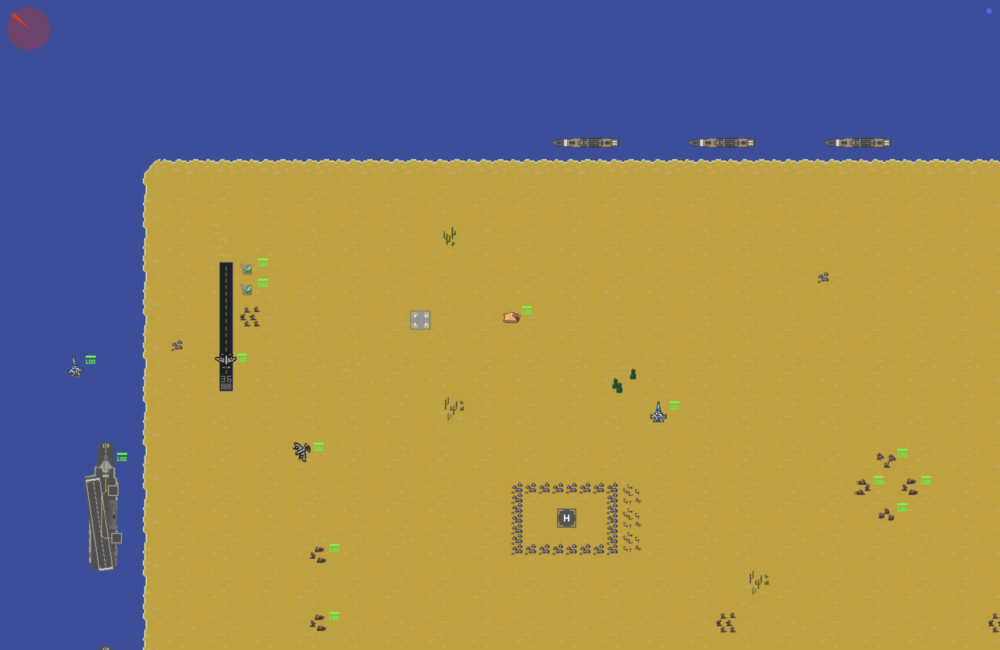

# 2D Game Engine

A 2D game engine built from scratch in C++17, focused on learning and implementing core game engine architecture. The engine uses an Entity Component System design, SDL2 for rendering, and Lua for level scripting.



## Tech Stack

- C++17
- SDL2 (rendering, input, window management)
- SDL2_image, SDL2_ttf, SDL2_mixer
- GLM (math)
- Sol2 + Lua 5.4 (scripting)
- Dear ImGui (debug UI)
- Makefile

## Features

**Entity Component System**
- Data oriented component pools with packed arrays
- Signature based system filtering
- Entity tagging (one unique name per entity)
- Entity grouping (shared category across many entities)
- Safe entity removal with swap and pop pool cleanup

**Rendering**
- Sprite rendering with z index sorting
- Animated sprites
- TrueType font rendering via SDL_ttf
- Health bar rendering
- Camera follow and offset rendering
- Sprite culling for off screen entities
- Sprite flipping

**Gameplay Systems**
- Rigid body movement with delta time
- Box collider AABB collision detection
- Keyboard controlled player movement
- Projectile emitter with timed auto fire
- Projectile lifecycle (auto kill on duration)
- Camera movement clamped to map boundaries
- Map boundary enforcement for the player
- Entity culling outside map bounds

**Events**
- Publish subscribe event bus
- Collision events
- Key pressed events
- Per frame subscription reset

**Scripting**
- Lua level files define all assets, tilemap config, and entities
- Per entity Lua update scripts called every frame
- C++ helper functions exposed to Lua (position, velocity, rotation, animation, projectile velocity)

**Debug Tools**
- Dear ImGui spawn panel
- Collider visualization overlay
- Mouse coordinate display
- Toggle with F1

## How to Build and Run

Requirements: SDL2, SDL2_image, SDL2_ttf, SDL2_mixer, Lua 5.4 installed via Homebrew.

```bash
make
make run
```

To clean the build:

```bash
make clean
```

## Project Structure

```
src/
  ECS/            Entity Component System core
  Components/     All component structs
  Systems/        All system classes
  Events/         Event definitions
  EventBus/       Publish subscribe event bus
  AssetStore/     Texture and font management
  Game/           Game loop, LevelLoader
  Logger/         Console logger
assets/
  images/         Sprite textures
  tilemaps/       Tilemap images and map files
  fonts/          TrueType fonts
  scripts/        Lua level scripts
libs/
  glm/            Math library
  imgui/          Dear ImGui
  lua/            Lua 5.4 headers
  sol/            Sol2 Lua binding library
```

## Architecture Notes

The engine follows a strict separation between data and logic. Components hold only plain data. Systems hold only logic and operate on entities that match their required component signature. No game object classes exist. Everything is an entity with a set of components attached.

Level data including assets, tilemap layout, entity definitions, and per entity Lua scripts lives entirely in Lua files under `assets/scripts/`. No level data is hardcoded in C++.
